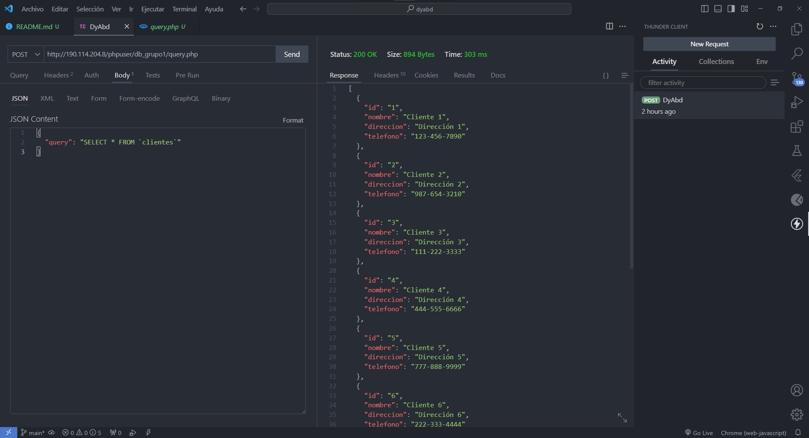

## Query

El código PHP en esta sección se utiliza para crear un servidor web que acepta solicitudes POST, ejecuta consultas SQL en una base de datos MySQL y devuelve los resultados en formato JSON. A continuación, se describen las partes clave del código:

1. **Cabeceras CORS**: Se establecen cabeceras CORS (Cross-Origin Resource Sharing) para permitir solicitudes desde cualquier origen, lo que es útil al acceder al servidor desde dominios diferentes.

2. **Verificación del método HTTP**: Se comprueba si la solicitud entrante es de tipo POST. Si es así, continúa con el procesamiento.

3. **Conexión a la base de datos**: Se configuran las credenciales de la base de datos y se intenta establecer una conexión con el servidor MySQL.

4. **Obtención del query SQL**: Se obtiene el query SQL del cuerpo de la solicitud POST, decodificando el JSON del cuerpo.

5. **Ejecución del query SQL**: El código ejecuta el query en la base de datos y recopila los resultados en un arreglo asociativo si la consulta tiene éxito.

6. **Respuesta JSON**: Si la consulta se realiza con éxito, los resultados se codifican como JSON y se envían de vuelta al cliente. Si hay un error, se envía un mensaje de error adecuado.

7. **Cierre de la conexión a la base de datos**: Se cierra la conexión a la base de datos al final de la operación.

8. **Manejo de solicitudes no válidas**: Si la solicitud no es de tipo POST, se envía un mensaje de error.

## Manager

En esta sección, se define una clase en Dart llamada `DatabaseService`. Esta clase se utiliza para realizar solicitudes HTTP POST al servidor PHP. A continuación, se explican las partes clave del código:

1. **Importaciones**: Se importan las bibliotecas `http` y `dart:convert` para realizar solicitudes HTTP y trabajar con JSON.

2. **Clase `DatabaseService`**: Esta clase encapsula la funcionalidad de comunicación con el servidor PHP.

3. **Propiedad `baseUrl`**: Almacena la URL del servidor PHP al que se realizarán las solicitudes HTTP.

4. **Método `getProducts`**: Este método envía una consulta SQL predefinida al servidor PHP, obtiene los resultados y los devuelve como una lista de mapas.

5. **Método `queryExample`**: Permite enviar consultas SQL personalizadas al servidor PHP, de manera similar al método `getProducts`.

## Example

La función `main` en esta sección ejemplifica el uso de la clase `DatabaseService`. Aquí se describe el código:

1. **Importación de la Clase `DatabaseService`**: La clase `DatabaseService` se importa del archivo correspondiente.

2. **Función `main`**: Es el punto de entrada de la aplicación y se ejecuta al iniciar la aplicación.

3. **Creación de una Instancia de `DatabaseService`**: Se crea una instancia de `DatabaseService` llamada `dbService` para acceder a sus métodos y realizar consultas a la base de datos.

4. **Bloque `try...catch`**: Se utiliza un bloque `try...catch` para manejar excepciones, especialmente importantes en operaciones asíncronas, como las solicitudes HTTP.

5. **Solicitud y Procesamiento de Datos**: Se realiza una solicitud a la base de datos utilizando el método `getProducts`. Los resultados se almacenan en la variable `results` y se imprimen en la consola.

6. **Manejo de Errores**: Si ocurre un error durante la solicitud de datos, se captura la excepción y se maneja en el bloque `catch`, donde se imprime un mensaje de error.

En resumen, el código se utiliza para comunicarse con un servidor PHP que ejecuta consultas SQL en una base de datos y devuelve resultados en formato JSON. La clase `DatabaseService` facilita la realización de solicitudes al servidor desde una aplicación Dart/Flutter, y el bloque `try...catch` permite un manejo de errores adecuado.
